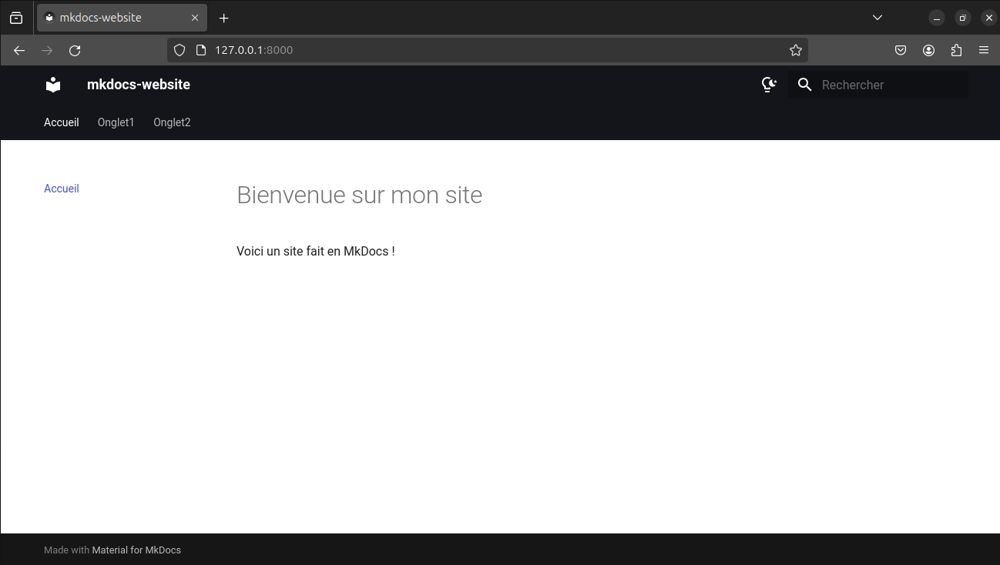
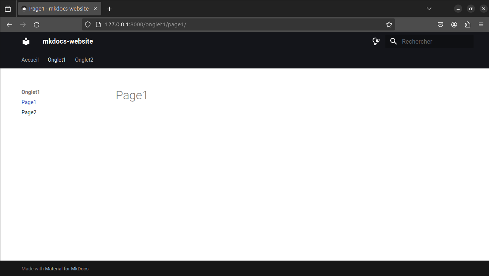
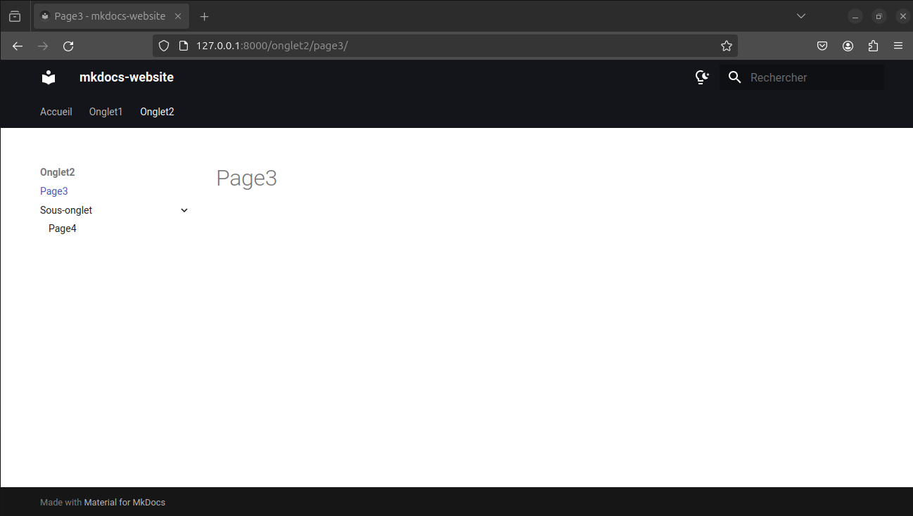

# Créer un site statique avec MkDocs

MkDocs est un générateur de site statique destiné à la création de documentation technique, principalement en utilisant des fichiers Markdown. Il est particulièrement populaire dans les communautés de développeurs et dans les projets open-source pour créer des sites web de documentation faciles à maintenir et à déployer, notamment sur Github.

Ce site a été créé en MkDocs !

## Installation

Pour installer MkDocs, nous allons utiliser [conda](https://docs.conda.io/projects/conda/en/latest/index.html). 

Dans un terminal : 
```
# Create a new env 
conda create -n mkdocs

# Activate the new env
conda activate mkdocs

# Check if python3 is properly installed
python3 --version

# Install pip package manager if it's necessary
sudo apt install python3-pip

# Install mkdocs
pip install mkdocs

# Install some plugins
pip install mkdocs-material mkdocs-material-extensions
```

## Créer un projet

Nous allons créer en premier un répertoire de travail

```
mkdir mkdocs-website
```

A l'intérieur du répertoire de travail, nous allons initialiser le projet :
```
mkdocs new .
```

Cette dernière commande va créer :

- un fichier *mkdocs.yml* dont voici le contenu : 
```
site_name: My Docs
```

- un dossier *docs* avec à l'intérieur un fichier *index.md* dont voici le contenu : 
```
# Welcome to MkDocs

For full documentation visit [mkdocs.org](https://www.mkdocs.org).

## Commands

* `mkdocs new [dir-name]` - Create a new project.
* `mkdocs serve` - Start the live-reloading docs server.
* `mkdocs build` - Build the documentation site.
* `mkdocs -h` - Print help message and exit.

## Project layout

    mkdocs.yml    # The configuration file.
    docs/
        index.md  # The documentation homepage.
        ...       # Other markdown pages, images and other files.
```

Ainsi notre projet a pour structure :
```
mkdocs-website/
├── docs/
│   └── index.md              # La page d'accueil du site
└── mkdocs.yml                # Fichier de configuration du site
```


## Modifier le contenu du site

Maitenant que tout est initialisé, nous allons créer notre site web à proprement parlé.

Pour ça, nous allons modifier le fichier de configuration et ajouter quelques lignes :
```
# Nom de votre site
site_name: mkdocs-website

# Description facultative (utilisée dans les métadonnées et les moteurs de recherche)
site_description: "Un site créé avec MkDocs"

# Chemin du logo (optionnel, à ajouter dans 'docs/' ou un sous-dossier 'images/')
# logo: images/logo.png

# Thème Material (nous l'avons installé avec `pip install mkdocs-material`)
theme:
  name: material  # Le thème utilisé est "Material"
  language: fr  # La langue du site est définie sur le français
  # Liste des fonctionnalités supplémentaires à activer dans le thème
  features:
    - navigation.tabs  # Active les onglets de navigation pour une meilleure organisation
    - navigation.expand  # Permet d'étendre ou de réduire les menus de navigation
    - navigation.indexes  # Active l'indexation dans la navigation pour une meilleure structuration
    - header.autohide  # Masque l'en-tête lorsque l'on fait défiler la page

  # Personnalisation de la palette de couleurs du site
  palette:
    - scheme: default  # Utilisation du schéma de couleurs par défaut
      primary: black  # Couleur principale, ici le noir pour l'en-tête
      accent: blue  # Couleur d'accentuation, ici le bleu pour les liens
      toggle:
        icon: material/lightbulb-night-outline  # Icône de mode sombre (ampoule éteinte). 
        name: Mode sombre  # Texte pour l'activation du mode sombre
    - scheme: slate  # Un autre schéma de couleurs (Slate, une teinte grise)
      primary: black  # Couleur principale (noir)
      accent: blue  # Couleur d'accent (bleu)
      toggle:
        icon: material/lightbulb-outline  # Icône de mode clair (ampoule allumée)
        name: Mode clair  # Texte pour l'activation du mode clair

  # Liste des autres fonctionnalités à activer
  features:
    - toc.follow  # Fait suivre le tableau des matières (TOC) avec le défilement de la page
    - toc.integrate  # Intègre le tableau des matières dans le contenu de la page
    - navigation.top  # Ajoute une barre de navigation en haut de la page
    - content.code.copy  # Ajoute un bouton pour copier le code dans le presse-papier
    - navigation.tabs  # Active à nouveau les onglets de navigation
    - search.highlight  # Met en surbrillance les résultats de recherche sur le site

# Extensions Markdown (activent des fonctionnalités supplémentaires)
markdown_extensions:
  - tables          # Support avancé pour les tableaux
  - toc             # Table des matières automatique
  - codehilite      # Mise en surbrillance du code
  - pymdownx.extra  # Collection d'extensions Markdown utiles
  - pymdownx.snippets  # Réutilisation de fragments de code

# Structure de la navigation (liée aux fichiers Markdown dans le dossier `docs/`)
nav:
  - Accueil: index.md
```

Ensuite, nous allons modifier le fichier *index.md* :
```
# Bienvenue sur mon site

Voici un site fait en MkDocs !
```

## Modifier la structure du site 

Pour le moment, notre site web n'a qu'une seule page. Nous allons en ajouter dans de nouveaux onglets.

Pour ça, nous allons créer et placer les nouvelles pages dans le dossier /docs à l'intérieur de nouveaux dossiers. 
Voici la structure dorénavant de notre site : 
```
mkdocs-website/
│
├── mkdocs.yml
│
└── docs/
    ├── index.md
    ├── onglet1/
    │   ├── page1.md
    │   └── page2.md
    ├── onglet2/
    │   ├── page3.md
    │   └── sous-onglet/
    │       └── page4.md
```

Dans le fichier *mkdocs.yml*, nous allons étayer la partie *nav* afin de renseigner cette nouvelle structure : 
```
# Structure de la navigation (liée aux fichiers Markdown dans le dossier `docs/`)
nav:
  - Accueil: index.md
  - Onglet1 : 
    - Page1 : onglet1/page1.md
    - Page2 : onglet1/page2.md
  - Onglet2 : 
    - Page3 : onglet2/page3.md
    - Sous-onglet :
      - Page4 : onglet2/sous-onglet/page4.md
```

## Lancer le serveur de développement

Notre site est prêt. Nous allons donc dorénavant le visualiser localement. 
Dans un terminal, il suffit de lancer dans le répertoire du projet au même niveau que le fichier *mkdocs.yml* :
```
mkdocs serve
```

Cela lance un serveur local à l'adresse http://127.0.0.1:8000. Il est alors possible d'ouvrir un navigateur à cette adresse pour voir à quoi ressemble le site.






